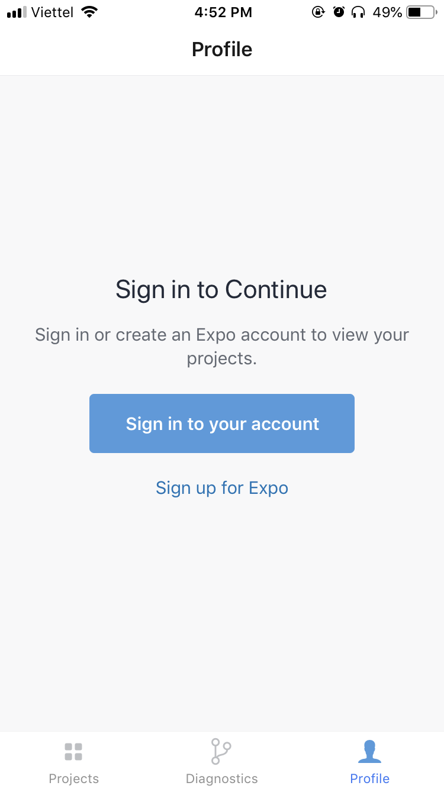
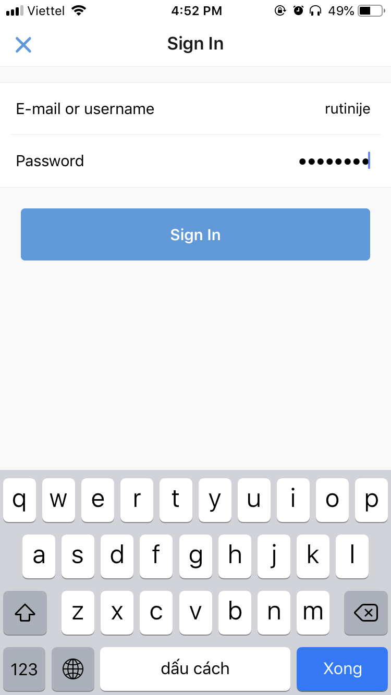
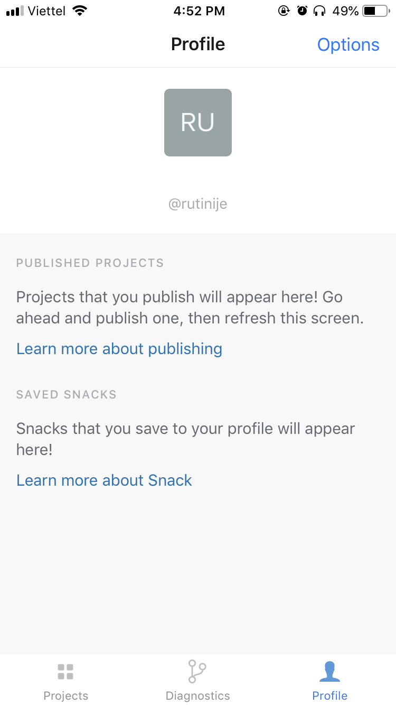
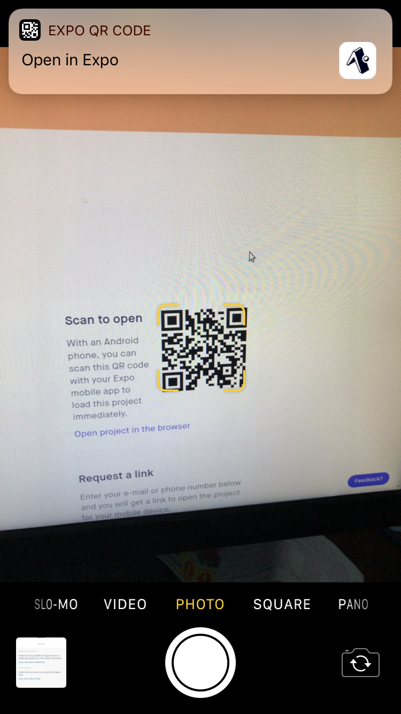
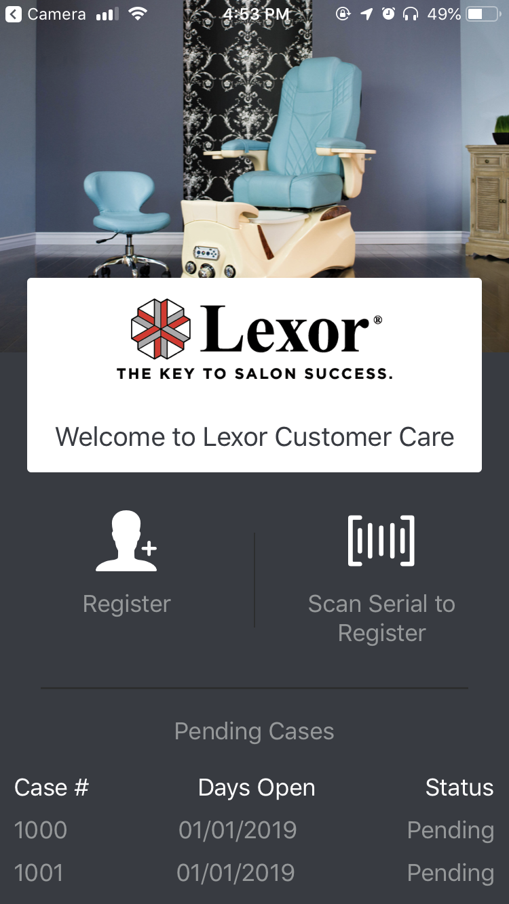

## Lexor Customer Care

### How to install on devices

> Note: I used Expo Client to setup demo app. Because It's easily to install and update.
>
> -   Expo Home Page: https://expo.io/
> -   Lexor Customer Care Expo: https://expo.io/@trungpv/LexorCustomerCareExpo
> -   iOS Expo Client: <https://itunes.apple.com/app/apple-store/id982107779>
> -   Android Expo Client: <https://play.google.com/store/apps/details?id=host.exp.exponent&referrer=www>

#### 1. Install on iOS and Android Devices

-   After Install Expo Client and Open it

-   Click Sign in and use this account to login Expo Client: rutinije / rutinije (Only iOS need Sign in)

-   After Sign in

-   After that use Camera App to Scan QR Code from <https://expo.io/@trungpv/LexorCustomerCareExpo>

 

-   Click Open in Expo and That's it

